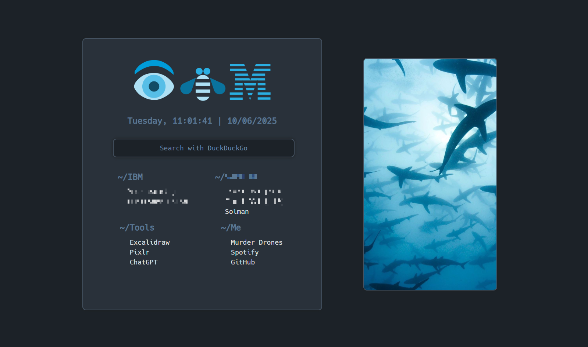

<h1 align="center">Startwage</h1>

<p align="center">A minimalist startpage designed for quick access to your top-priority websites</p>



This is a fork of [druxorey/startpage](https://github.com/druxorey/startpage), designed to be my browser homepage **at work.** It has quick links to websites I need to access, a search bar and it's customizable via a .json file.

Unlike druxorey's original project, which works fine as a GitHub Pages site and can mostly only be altered via direct modification of the main HTML template and CSS files, this fork is oriented to be self-hostable and dynamic, adapting to the settings specified in the `config.json` where possible (Bookmarks, image, greeting, themes and search engines). For this reason, the project runs on a minimal webserver written in Python's Flask framework.

## Config

The project will error if a `config.json` file ins't found in the root directory.

The root object contains three main properties:

```json
{
  "greeting": {
    "text": "hey there",
    "image": "logo.png"
  },
  "image": "background.jpg",
  "shortcuts": [
    // shortcuts ...
  ]
}
```

### greeting (Object): Configuration for the greeting display

A greeting can have a text and image

Greeting with Image Only (No Text)

```json
{
  "greeting": {
    "text": false,
    "image": "welcome_banner.png"
  },
  "image": "dashboard_background.jpg",
  "shortcuts": [
    // ... (same as original shortcuts structure)
  ]
}
```

Behavior:

Displays only welcome_banner.png (no text greeting).

Greeting with Text Only (No Image)

```json
{
  "greeting": {
    "text": "Welcome back, User! 👋",
    "image": false
  },
  "image": "dashboard_background.jpg",
  "shortcuts": [
    // ... (same as original shortcuts structure)
  ]
}
```

Behavior:

Shows the text "Welcome back, User! 👋" (no image).

Greeting with Both Text and Image

```json
{
  "greeting": {
    "text": "Hello! Ready for the day?",
    "image": "motivational_quote.png"
  },
  "image": "dashboard_background.jpg",
  "shortcuts": [
    // ... (same as original shortcuts structure)
  ]
}
```

Behavior:

Displays both the text "Hello! Ready for the day?" and motivational_quote.png.

### text (Boolean/string)

Indicates whether a text greeting should be displayed (false means no text greeting, string is the text that will be displayed)

### image (String)

Filename/path of an image to display as part of the greeting

### image (String)

Filename/path of the main image to display on the dashboard

### shortcuts (Array)

```json
"shortcuts": [
    {
      "sectName": "Dev Tools",
      "shortcuts": [
        { "name": "VS Code", "url": "https://vscode.dev/" },
        { "name": "GitHub", "url": "https://github.com/" },
        { "name": "Stack Overflow", "url": "https://stackoverflow.com/" }
      ]
    },
    {
      "sectName": "Fun",
      "shortcuts": [
        { "name": "YouTube", "url": "https://youtube.com/" },
        { "name": "Netflix", "url": "https://netflix.com/" }
      ]
    }
  ]
```

A collection of shortcut categories, each containing multiple shortcuts

Each **category** in the shortcuts array has:

- sectName (String)

The name/heading of the category section

- shortcuts (Array)

List of shortcuts within this category

Each **shortcut object** contains:

- name (String)

Display name of the shortcut

- url (String)

The URL the shortcut links to

# Contributing

## Repository Structure

- **resources**: This directory contains screenshots of the page.
- **scripts**: This directory contains the scripts used in the startpage.
- **static**: This directory contains the CSS and other files used in the startpage.

## Keyboard Shortcuts

The following keyboard shortcuts are available on the search page:

- **Escape**: Hide the settings panel.
- **Alt + Space**: Focus on the search input field.
- **Enter**: Execute the search.
- **Ctrl + C**: Clear the search input field.

## Contribute

If you want to make any change, follow these steps:

1. Open an issue to discuss the changes.
2. Fork this repository.
3. Create a new branch for your contribution: `git checkout -b your-branch-name`.
4. Make your changes.
5. Commit your changes, for example: `git commit -m 'fix: incorrect svg path'`.
6. Push your changes to your forked repository: `git push origin your-branch-name`.
7. Open a Pull Request in this repository and reference the original issue.

## License

This project is licensed under the GPL-3.0 License. See the [LICENSE](LICENSE) file for more details.

## Credits

- Fork of [Druxorey's Startpage](https://github.com/druxorey/startpage).
- Druxorey's project was inspired by [Fxzii Startpage](https://github.com/Fxzzi/startpage).
